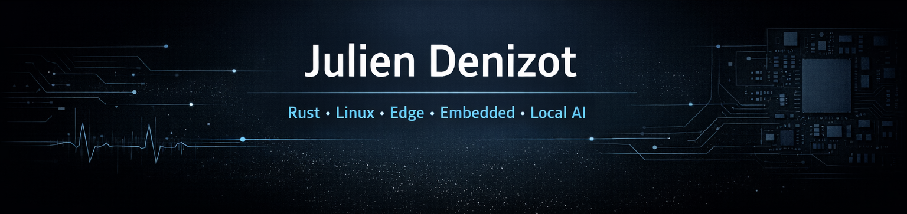

# Hi, I'm Julien

**Rust Systems Engineer**  
*Edge · Embedded · Local AI · Healthcare*

I build software and systems that connect code to the real world.

My interests sit at the intersection of **Rust**, **Linux**, **embedded systems**, **edge infrastructure**, **local AI**, and **healthcare technology**. I like working on things that are fast, reliable, useful, and close to the field — from backend services and on-prem inference to hardware integration and real-world deployment.

---

## What I’m into

- Rust backend and systems programming
- Edge and on-prem infrastructure
- Embedded / IoT systems
- Local AI and inference
- Real-time communication
- Healthcare and interoperable systems
- Projects involving both software and hardware

---

## A bit about me

My background is unusual on purpose.

Before moving into software and systems engineering, I worked in **orthotics**, which gave me a strong connection to real users, real constraints, and real-world problem solving. Today, I bring that same mindset into engineering: build things that are technically solid, physically deployable, and actually useful.

I’m especially interested in systems that leave the screen:  
**devices, sensors, readers, edge nodes, local servers, field deployment, and critical workflows**.

---

## Things I build

### Real-time systems
Backend services in Rust with fast decision loops, device communication, and production-oriented reliability.

### Edge and on-prem setups
Self-hosted and privacy-friendly architectures with local control, secure networking, and minimal cloud dependency.

### Local AI
Experimenting with local inference, RAG pipelines, embedded AI, and practical LLM deployments.

### Healthcare-oriented tools
Software that combines technical engineering with healthcare domain understanding, especially where interoperability and clinical reality matter.

---

## Current focus

- Rust systems programming
- Embedded and hardware-oriented projects
- Local AI tooling
- Healthcare software
- Building projects that connect software, machines, and real usage

---

## Selected technologies

**Languages**  
Rust · Python · C++ · JavaScript

**Systems / Backend**  
Axum · Tokio · WebSocket · MQTT · Linux

**Infra / Edge**  
Docker · Proxmox · Traefik · VPN · Self-hosting

**Local AI**  
Candle · Burn · HuggingFace · llama.cpp · GGUF · RAG · Embeddings

**Health Tech**  
HL7 · FHIR · DICOM

---

## Featured work

### Enuxia
Systems engineering, edge infrastructure, local AI, and real-world deployments.

### Orthotics decision-support software
A project at the crossroads of clinical experience and software engineering.

### FPV drone build
A personal project that reflects what I enjoy most: understanding systems end-to-end, including hardware.

---

## GitHub stats

---

## Connect

---

> I like building systems that don’t stop at the screen.
